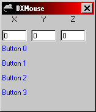



## DX Mouse

### Description

This code will show you how to use Direct Input to get info from the mouse. It has lots of comments and is not all that complex. Can you please give me some feed back.
 
### More Info
 
This code assumes that you have VB 6 (5 might work) and DirectX 7

             |
---                |---
**Submitted On**   |2000-10-08 22:07:00
**By**             |[Sauron](https://github.com/Planet-Source-Code/PSCIndex/blob/master/ByAuthor/sauron.md)
**Level**          |Intermediate
**User Rating**    |4.3 (17 globes from 4 users)
**Compatibility**  |VB 6\.0
**Category**       |[DirectX](https://github.com/Planet-Source-Code/PSCIndex/blob/master/ByCategory/directx__1-44.md)
**World**          |[Visual Basic](https://github.com/Planet-Source-Code/PSCIndex/blob/master/ByWorld/visual-basic.md)
**Archive File**   |[CODE\_UPLOAD105011082000\.zip](https://github.com/Planet-Source-Code/sauron-dx-mouse__1-11949/archive/master.zip)

